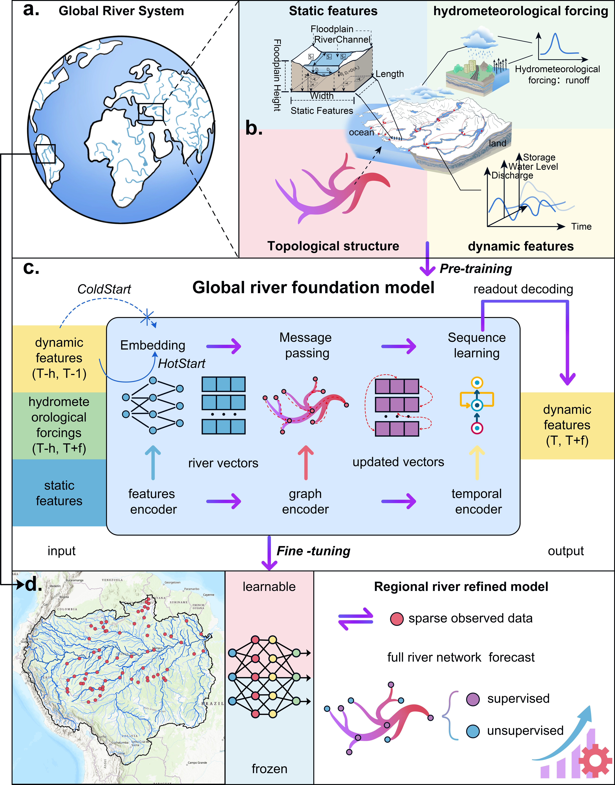
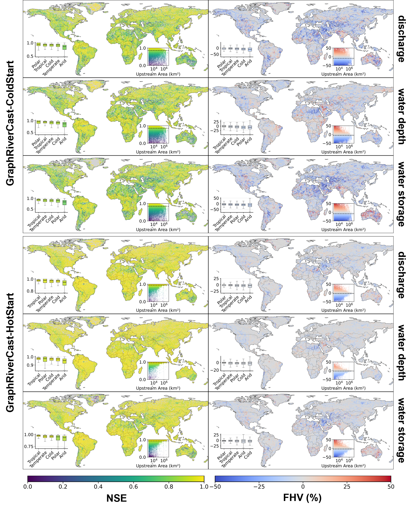

<h1 align="center">GraphRiverCast</h1>

<p align="center">
  <strong>A Topology-Informed Foundation Model for Global Multivariate River Hydrodynamic Forecasting</strong>
</p>

<p align="center">
  <a href="https://arxiv.org/abs/2602.22293"></a>&nbsp;
  &nbsp;
  &nbsp;
  &nbsp;
  
</p>

---

## ✨ Highlights

- 🌍 **Global coverage** — Forecasts discharge, water depth, and storage across **120,000+ river reaches** worldwide at daily resolution
- 🔗 **Topology as structural prior** — River network connectivity is the foundational constraint governing hydrodynamic evolution; ablation confirms topology is indispensable for network-scale mass redistribution
- 🔄 **Dual operational modes** — ColdStart (standalone hydrodynamic simulator; recommended fine-tuning base) and HotStart (with state initialization for operational forecasting)
- 📈 **Effective transfer learning** — Fine-tuning on sparse gauge data surpasses the physics-based CaMa-Flood baseline even at ungauged sites
- ⚡ **Lightweight & efficient** — ~50K parameters per group; real-time inference on consumer GPUs and Apple Silicon

---

## 📑 Table of Contents

- [🌊 Overview](#-overview)
- [🏗️ Model Architecture](#%EF%B8%8F-model-architecture)
- [📊 Global Performance](#-global-performance)
- [📁 Directory Structure](#-directory-structure)
- [⚙️ Environment Setup](#%EF%B8%8F-environment-setup)
- [📦 Data Preparation](#-data-preparation)
- [🚀 Usage](#-usage)
- [🎯 Selecting the Right Checkpoint](#-selecting-the-right-checkpoint)
- [📄 Citation](#-citation)
- [📜 License](#-license)
- [🙏 Acknowledgments](#-acknowledgments)

---

## 🌊 Overview

GraphRiverCast (GRC) is a topology-informed foundation model for global multivariate river hydrodynamic forecasting. It encodes river network connectivity as the **primary structural constraint** within a spatiotemporal neural operator, enabling physics-aligned prediction of discharge, water depth, and storage across **120,000+ river reaches** worldwide (derived from CaMa-Flood at 0.25° resolution).

**Core design principle:** River network topology is not auxiliary input — it is the foundational structural constraint governing hydrodynamic evolution. Ablation experiments reveal that topology's contribution is **context-dependent**: in ColdStart mode, topology becomes indispensable for enforcing network-scale mass redistribution; in HotStart mode, local temporal inertia dominates. This resolves prior debates about topology's utility in neural hydrology.

### Two Operational Modes

| Mode | River-state initialisation | Behaviour | Best for |
|------|---------------------------|-----------|----------|
| **GRC-ColdStart** | Not required | Standalone hydrodynamic simulator driven solely by runoff forcings; stable long-term operation | Data-sparse regions; ungauged basins; **fine-tuning base** ① |
| **GRC-HotStart** | Required | Leverages prior river states; maximises short-term forecasting fidelity | Operational forecasting with gauge / reanalysis states |

> ① All fine-tuning in the paper uses ColdStart. See [Why ColdStart for fine-tuning?](#why-coldstart-is-the-recommended-base-for-fine-tuning) for the full rationale.

---

## 🏗️ Model Architecture

GRC fuses three complementary encoders — **feature** (static geomorphic attributes), **graph** (river network topology), and **temporal** (state evolution) — within a topology-informed neural operator framework, achieving structural alignment with physics-based river models while enabling efficient spatiotemporal learning on non-Euclidean river networks.

<p align="center">
  
</p>

<p align="center"><sub>
<b>Figure 1.</b> GraphRiverCast framework overview. <b>(a)</b> Global river system at CaMa-Flood 0.25° resolution. <b>(b)</b> Multi-source input features: static geomorphic attributes, topological structure, and hydrometeorological forcings. <b>(c)</b> Spatiotemporal neural operator with feature encoder, graph encoder, and temporal encoder. <b>(d)</b> Regional fine-tuning with sparse gauge observations.
</sub></p>

```
Input (per time step)
  ├── Runoff forcing            [T, N, 1]   ← meteorological lateral inflow
  ├── River states (HotStart)   [T, N, 3]   ← discharge, water depth, storage
  ├── Static geomorphic vars    [N, 18]     ← channel geometry, elevation, …
  └── River network topology    [2, E]      ← directed edge list (upstream → downstream)

  ▼
┌──────────────────────────────────────────────────────────┐
│  Embedding Layer          Linear → hidden_dim (64)       │
│       ↓                                                  │
│  Feature Mixing Block     MLP (64 → 128 → 64)           │
│       ├── RMSNorm  (pre-norm)                            │
│       ├── SiLU activation                                │
│       └── + residual                                     │
│       ↓                                                  │
│  Graph Encoder (GCN)      2-layer residual GCN           │
│       ├── RMSNorm  (pre-norm)                            │
│       ├── GELU activation                                │
│       └── Propagates info along river-network topology   │
│       ↓                                                  │
│  Temporal Encoder (GRU)   1-layer GRU                    │
│       ├── RMSNorm  (pre-norm)                            │
│       └── + residual                                     │
│       ↓                                                  │
│  Output Norm              RMSNorm                        │
│       ↓                                                  │
│  Readout Layer            Linear (64 → 3)  →  Δ         │
│       ↓                                                  │
│  ◄ Physics-aligned residual:                             │
│       state_t  =  state_{t−1}  +  Δ                     │
│       └── feeds back into next time step (autoregressive)│
└──────────────────────────────────────────────────────────┘

Output: [discharge, water_depth, storage]  per reach, per time step
```

> **Why residual prediction?** Predicting Δ instead of absolute values aligns the network with the continuity structure of river hydrodynamics — the model acts as a learned evolution operator rather than a direct regressor.

---

## 📊 Global Performance

Evaluated on a **global daily 7-day pseudo-hindcast benchmark** — 120,000+ river reaches at CaMa-Flood 0.25° resolution, daily time step, independent test period 2018–2019:

| Mode | Discharge NSE | Water-depth NSE | Storage NSE |
|------|:---:|:---:|:---:|
| **GRC-ColdStart** | 0.82 | 0.82 | 0.79 |
| **GRC-HotStart** | **0.93** | **0.95** | **0.92** |

<p align="center">
  
</p>

<p align="center"><sub>
<b>Figure 2.</b> Global evaluation of GraphRiverCast. <b>Left:</b> per-reach Nash–Sutcliffe Efficiency (NSE). <b>Right:</b> percentage bias in high-flow volume (FHV). Top three rows: GRC-ColdStart; bottom three rows: GRC-HotStart. Insets show NSE vs. upstream drainage area.
</sub></p>

---

## 📁 Directory Structure

```
GraphRiverCast/
├── README.md
├── requirements.txt            # pip dependencies
├── pyproject.toml              # Package metadata & build config
├── environment.yml             # Conda environment (alternative setup)
├── group_lookup.html           # Interactive map: basin → Group ID (open in any browser)
├── Figures/                    # Paper figures
├── scripts/
│   ├── setup_unix.sh           # Linux / WSL  — uv-based, auto-detects GPU + CUDA
│   ├── setup_windows.bat       # Windows      — Conda-based, auto-detects GPU + CUDA
│   └── setup_macos.sh          # macOS        — uv-based, auto-detects Apple Silicon / Intel
├── src/
│   ├── __init__.py
│   ├── model.py                # GRC model (Feature / Graph / Temporal encoders)
│   ├── inference.py            # Inference script (GRC-HotStart)
│   └── finetune.py             # Fine-tuning script + freeze-profile definitions
├── checkpoints/
│   ├── mpireg-16.bin           # CaMa-Flood MPI 16-group partition grid
│   ├── Pre-train/
│   │   ├── GRC_ColdStart/      # Group_1.ckpt … Group_16.ckpt
│   │   ├── GRC_HotStart/       # Group_1.ckpt … Group_16.ckpt
│   │   └── Ablation/           # Group_{N}_{features}_{mode}.ckpt
│   └── Fine-tune/
│       └── Amazon/             # Example: Amazon basin fine-tuned checkpoints
├── data/                       # Input data (see Data Preparation)
└── results/                    # Inference / fine-tuning output
```

---

## ⚙️ Environment Setup

### 📋 Quick Reference

| Platform | Script | Package manager | Auto-detects |
|----------|--------|-----------------|--------------|
| Linux / WSL | `./scripts/setup_unix.sh` | **uv** (venv) | GPU, CUDA version, RTX 40/50 |
| Windows | `scripts\setup_windows.bat` | **Conda** | GPU, CUDA version, RTX 40/50 |
| macOS | `./scripts/setup_macos.sh` | **uv** (venv) | Apple Silicon / Intel, MPS |

Every script performs **four steps** automatically:

1. Detect hardware (GPU model, CUDA version, compute capability)
2. Create an isolated **Python 3.11** environment
3. Install the correct PyTorch build (`cpu` / `cu118` / `cu121` / `cu124` / `cu128`)
4. Install remaining dependencies (`torch-geometric`, `numpy`, `scipy`, `tqdm`, `omegaconf`, `matplotlib`)

### 🐧 Linux / WSL

```bash
cd GraphRiverCast
chmod +x scripts/setup_unix.sh

./scripts/setup_unix.sh          # auto-detect (recommended)
# ./scripts/setup_unix.sh cpu    # force CPU-only
# ./scripts/setup_unix.sh cuda   # force CUDA (auto-detect CUDA version)
```

Activate & quick-run:

```bash
source .venv/bin/activate

python src/inference.py \
    --ckpt   checkpoints/Pre-train/GRC_HotStart/Group_16.ckpt \
    --data-dir data \
    --group  LamaH_CE_06min_obs2000_2017 \
    --device cuda
```

### 🪟 Windows (Conda)

**Prerequisite:** [Miniconda](https://docs.conda.io/en/latest/miniconda.html) or [Anaconda](https://www.anaconda.com/download) installed. Run from **Anaconda Prompt**.

```cmd
cd C:\path\to\GraphRiverCast

scripts\setup_windows.bat        :: auto-detect (recommended)
:: scripts\setup_windows.bat cpu  :: force CPU-only
:: scripts\setup_windows.bat cuda :: force CUDA
```

Activate & quick-run:

```cmd
conda activate grc

python src/inference.py ^
    --ckpt   checkpoints\Pre-train\GRC_HotStart\Group_16.ckpt ^
    --data-dir data ^
    --group  LamaH_CE_06min_obs2000_2017 ^
    --device cuda
```

### 🍎 macOS

```bash
cd GraphRiverCast
chmod +x scripts/setup_macos.sh

./scripts/setup_macos.sh         # auto-detect (recommended)
# ./scripts/setup_macos.sh cpu   # force CPU-only
# ./scripts/setup_macos.sh mps   # force MPS (Apple Silicon only)
```

Activate & quick-run:

```bash
source .venv/bin/activate

# Apple Silicon — use MPS
python src/inference.py \
    --ckpt   checkpoints/Pre-train/GRC_HotStart/Group_16.ckpt \
    --data-dir data \
    --group  LamaH_CE_06min_obs2000_2017 \
    --device mps

# Intel Mac — use CPU
# python src/inference.py … --device cpu
```

### 🔄 Alternative: Conda (All Platforms)

```bash
conda env create -f environment.yml
conda activate grc
```

> `environment.yml` ships with `cpuonly` by default. Edit it to switch to a CUDA build if needed.

### 🖥️ GPU Architecture Support

| Series | Architecture | Compute Cap | Minimum CUDA | Auto-detected |
|--------|-------------|:-----------:|:------------:|:---:|
| RTX 50 | Blackwell | sm_120 | 12.8 | ✅ |
| RTX 40 | Ada Lovelace | sm_89 | 11.8 | ✅ |
| RTX 30 | Ampere | sm_86 | 11.1 | ✅ |
| RTX 20 | Turing | sm_75 | 10.0 | ✅ |
| Apple M1/M2/M3/M4 | — | — | MPS | ✅ |

### ✔️ Verify Installation

```bash
python -c "
import torch, torch_geometric
print(f'PyTorch         {torch.__version__}')
print(f'PyG             {torch_geometric.__version__}')
print(f'CUDA available  {torch.cuda.is_available()}')
print(f'MPS  available  {torch.backends.mps.is_available()}')"
```

---

## 📦 Data Preparation

All data for one basin lives in a single **group directory**:

```
data/<group_name>/
├── dynamic_var.npz      # Time-series: outflw, rivdph, storage, runoff
├── static_var.npz       # Static geomorphic features (per-reach)
├── edge_index.npy       # River-network graph edges  [2, E]
└── FineTuning.npz       # (Optional) Gauge observations for fine-tuning
```

> **Example data:** Upper Danube Basin `LamaH_CE_06min_obs2000_2017` is included. Sources: CaMa-Flood (dynamics), MERIT Hydro (topology & statics), LamaH-CE / GRDC (observations).

### 1️⃣ Dynamic Variables — `dynamic_var.npz`

Shape of each array: **`[Time, Nodes]`**. Time resolution: daily.

| Key | Variable | Unit |
|-----|----------|------|
| `outflw` | River discharge | m³/s |
| `rivdph` | Water depth | m |
| `storage` | Water storage | m³ |
| `runoff` | Lateral inflow (runoff forcing) | m³/s |

**Required metadata keys:**

| Key | Type | Example |
|-----|------|---------|
| `start_date` | str | `"2000-01-01"` |
| `end_date` | str | `"2019-12-31"` |
| `total_days` | int | `7305` |
| `timestamps` | datetime array | — |
| `shape_info` | int\[2\] | `[7305, 1409]` → \[days, reaches\] |

```python
import numpy as np

np.savez("dynamic_var.npz",
         outflw    = outflw,       # float64 [T, N]
         rivdph    = rivdph,       # float64 [T, N]
         storage   = storage,      # float64 [T, N]
         runoff    = runoff,       # float64 [T, N]
         start_date="2000-01-01",
         end_date  ="2019-12-31",
         total_days=7305,
         timestamps=timestamps,
         shape_info=np.array([7305, 1409], dtype=np.int32))
```

### 2️⃣ Static Variables — `static_var.npz`

One value (or vector) per river reach. Shape: `[N]` or `[N, K]`.

| Key | Description | Unit | Shape |
|-----|-------------|------|-------|
| `ctmare` | Catchment area | km² | \[N\] |
| `elevtn` | Elevation | m | \[N\] |
| `grdare` | Grid-cell area | km² | \[N\] |
| `nxtdst` | Distance to next downstream reach | m | \[N\] |
| `rivlen` | Reach length | m | \[N\] |
| `rivwth_gwdlr` | River width (GWDLR) | m | \[N\] |
| `uparea` | Upstream drainage area | km² | \[N\] |
| `width` | Channel width | m | \[N\] |
| `fldhgt` | Floodplain height profile | m | \[N, 10\] |

```python
np.savez("static_var.npz",
         ctmare=ctmare, elevtn=elevtn, grdare=grdare,
         nxtdst=nxtdst, rivlen=rivlen, rivwth_gwdlr=rivwth,
         uparea=uparea, width=width,  fldhgt=fldhgt)   # all float32
```

### 3️⃣ Edge Index — `edge_index.npy`

Directed graph edge list: **row 0 = source (upstream), row 1 = target (downstream)**.

```
Shape:   [2, E]          E = number of edges (≈ N − 1 for a tree network)
Indices: 0-based int64
```

```python
# edge_index[0, i] → edge_index[1, i]  means upstream → downstream
edge_index = np.array([
    [upstream_0,   upstream_1,   …],   # source nodes
    [downstream_0, downstream_1, …]    # target nodes
], dtype=np.int64)

np.save("edge_index.npy", edge_index)
```

**Construction steps:**

1. Extract river reaches from MERIT Hydro or your routing model.
2. For each reach identify its single downstream connection.
3. Build directed edges: upstream → downstream.

### 4️⃣ Fine-tuning Observations — `FineTuning.npz` (optional)

Required **only** when fine-tuning. Contains discharge observations at a subset of gauging stations (e.g. GRDC).

| Key | Description | Shape |
|-----|-------------|-------|
| `OBS` | Observed discharge | \[T_obs, N_stations\] float32 |
| `node_idx` | Reach indices with observations | \[N_stations\] int |
| `Time` | Observation timestamps | \[T_obs\] |

```python
np.savez("FineTuning.npz",
         OBS      = obs_discharge,   # [T, S] float32
         node_idx = station_idx,     # [S]    int  — maps stations → reach indices
         Time     = timestamps)      # [T]    datetime64
```

### 🗃️ Data Sources

| Component | Source |
|-----------|--------|
| River network topology & static features | [MERIT Hydro](http://hydro.iis.u-tokyo.ac.jp/~yamadai/MERIT_Hydro/) / CaMa-Flood |
| Dynamic variables (simulated) | CaMa-Flood driven by bias-corrected [GRADES](https://doi.org/10.1029/2019WR025287) runoff (Lin et al., 2019) |
| Discharge observations | [GRDC — Global Runoff Data Centre](https://grdc.bafg.de/) |
| Upper Danube observations | [LamaH-CE](https://doi.org/10.5281/zenodo.4525244) (Klingler et al., 2021) |

---

## 🚀 Usage

### 1️⃣ Inference

> `src/inference.py` runs **GRC-HotStart** mode: it takes historical river states as initial conditions and predicts future multivariate states.

**Example** (Upper Danube, Group 16):

```bash
# 1. Activate your environment
source .venv/bin/activate          # Linux / WSL / macOS
# or:  conda activate grc          # Windows

# 2. Run inference
python src/inference.py \
    --ckpt     checkpoints/Pre-train/GRC_HotStart/Group_16.ckpt \
    --data-dir data \
    --group    LamaH_CE_06min_obs2000_2017 \
    --device   cuda
```

#### All Inference Parameters

| Flag | Description | Default |
|------|-------------|---------|
| `--ckpt` | Checkpoint file path | *required* |
| `--data-dir` | Root data directory | `data` |
| `--group` | Dataset folder name inside `data/` | `LamaH_CE06min_obs2000_2017` |
| `--save-dir` | Output root directory | `results` |
| `--start` | Prediction start date | `2009-01-01` |
| `--hist` | History window (days) | `365` |
| `--future` | Forecast window (days) | `2922` |
| `--fit-start` | Normalisation-fit window start | `2000-01-01` |
| `--fit-end` | Normalisation-fit window end | `2017-12-31` |
| `--device` | `cpu` \| `cuda` \| `mps` | `cpu` |

#### Output Layout

```
results/
└── <group>_<ckpt_name>_<YYYYMMDD_HHMMSS>/
    ├── prediction.npy    # [Time, Nodes, 3]  — predicted [outflw, rivdph, storage]
    ├── groundtruth.npy   # [Time, Nodes, 3]  — ground truth
    └── meta.json         # run config + timing breakdown
```

---

### 2️⃣ Fine-tuning

> Fine-tuning adapts the pre-trained foundation model to **local gauge observations**, bridging global hydrodynamic knowledge with sparse regional data. **Always start from a GRC-ColdStart checkpoint** — see [Why ColdStart for fine-tuning?](#why-coldstart-is-the-recommended-base-for-fine-tuning).

**Example** (Upper Danube, Group 16):

```bash
python src/finetune.py \
    --ckpt            checkpoints/Pre-train/GRC_ColdStart/Group_16.ckpt \
    --data-dir        data \
    --group           LamaH_CE_06min_obs2000_2017 \
    --save-dir        results/finetune \
    --train-start     2000-01-01 \
    --train-end       2009-12-31 \
    --val-start       2010-01-01 \
    --val-end         2017-12-31 \
    --freeze-profile  p4_add_featmix \
    --hist            14 \
    --future          14 \
    --batch-size      16 \
    --epochs          50 \
    --lr              1e-4 \
    --device          cuda
```

#### All Fine-tuning Parameters

| Flag | Description | Default |
|------|-------------|---------|
| `--ckpt` | Pre-trained checkpoint (`None` = train from scratch) | `None` |
| `--data-dir` | Root data directory | `data` |
| `--group` | Dataset folder name | `LamaH_CE06min_obs2000_2017` |
| `--save-dir` | Output directory | `results/finetune` |
| `--pretrain-start/end` | Normalisation range | `2000-01-01` – `2009-12-31` |
| `--train-start/end` | Training period | `2000-01-01` – `2009-12-31` |
| `--val-start/end` | Validation period | `2010-01-01` – `2017-12-31` |
| `--hist` | History window (days) | `14` |
| `--future` | Forecast window (days) | `14` |
| `--batch-size` | Batch size | `16` |
| `--epochs` | Training epochs | `50` |
| `--lr` | Base learning rate | `1e-4` |
| `--weight-decay` | Weight decay | `1e-4` |
| `--freeze-profile` | Layer-freezing strategy (see below) | `p4_add_featmix` |
| `--device` | `cpu` \| `cuda` \| `mps` | `cpu` |

#### 🧊 Freeze Profiles — Choosing the Right Depth

The freeze profile controls **which layers are updated** during fine-tuning and at what relative learning rate.

The guiding rule is simple: **more observation stations → deeper unfreezing.** Select the profile that matches your observation density.

| Profile | Layers unfrozen | When to use |
|---------|-----------------|-------------|
| `p0_head` | Readout only | Very few stations (< 5) |
| `p1_head_norm` | + normalisation layers | Very limited data |
| `p2_spatial_last` | + last GCN layer | ~10–30 stations |
| `p3_temporal_input_only` | + GRU input gates | ~30–50 stations |
| **`p4_add_featmix`** | **+ feature-mixing MLP** | **General-purpose default** |
| `p5_add_embed` | + embedding layer | Rich observation data |
| `p6_spatial_all` | + all GCN layers | Dense network (100+ stations) |
| `p7_temporal_recurrent` | + GRU recurrent gates | Very large dataset |
| `p8_full` | All layers unfrozen | Full retraining with abundant data |
| `p9_scratch` | All layers, no pretrained weights | No pretrained checkpoint available |

Full per-layer learning-rate multipliers are defined in [`src/finetune.py`](src/finetune.py) → `get_profile_spec()`.

#### 🔧 Train from Scratch (No Pre-trained Weights)

**Example**:

```bash
python src/finetune.py \
    --data-dir data --group LamaH_CE_06min_obs2000_2017 \
    --save-dir results/scratch \
    --freeze-profile p9_scratch \
    --epochs 100 --lr 1e-3 --device cuda
```

---

## 🎯 Selecting the Right Checkpoint

### 🌐 Step 1 — Why 16 Groups?

The global river network (~128K reaches from CaMa-Flood) is partitioned into **16 independent groups** following CaMa-Flood's MPI domain decomposition. Two invariants govern the split:

1. **No river is cut at a group boundary** — full hydrologic connectivity is preserved within each group.
2. Each group holds a roughly equal number of reaches (~8,000).

Each group is pre-trained independently, so you must pick the checkpoint that **contains your target basin**.

### 📍 Step 2 — Find Your Group

> 👉 **[Open the Interactive Group Lookup Map](https://rhc123123.github.io/GraphRiverCast/group_lookup.html)** — click to find which Group contains your target basin.

Alternatively, open **`group_lookup.html`** locally in any web browser (no installation needed). It renders an interactive, colour-coded world map built directly from `mpireg-16.bin`.

| Action | What it does |
|--------|--------------|
| **Hover** | Shows live coordinates + Group number |
| **Click** | Locks the point; displays the full result panel |
| **Dropdown** | Quick-select from 30 representative major basins |
| **Lat / Lon input** | Type coordinates and press *Find* |

> Basin names in the dropdown are representative examples only — each group covers many additional river segments worldwide.

### 🔀 Step 3 — ColdStart or HotStart?

| Mode | Needs initial river states? | Typical use case |
|------|:--:|------------------|
| **GRC-ColdStart** | No | Data-sparse / ungauged regions; long free-running simulation; **fine-tuning** |
| **GRC-HotStart** | Yes | Operational forecasting where gauge or reanalysis states are available |

#### Why ColdStart is the recommended base for fine-tuning

In ColdStart mode the model cannot "shortcut" via prior river-state values — it must learn the complete **runoff → streamflow** mapping from topology and forcings alone. Ablation experiments (paper, Fig. 3) confirm three consequences:

1. **Topology is deeply internalised.** Removing topology in ColdStart causes a large NSE drop (0.82 → 0.69), far steeper than in HotStart (0.93 → 0.89).
2. **The learned mapping is more robust and transferable.** Because the model cannot rely on initial-state information as a shortcut, the runoff–streamflow relationship it encodes generalises better to new regions.
3. **Empirical evidence.** All fine-tuning experiments in the paper (Amazon Basin, Upper Danube Basin) start from GRC-ColdStart and consistently surpass the CaMa-Flood baseline after adaptation.

> **Decision: always fine-tune from `Pre-train/GRC_ColdStart/Group_{N}.ckpt`.**

```bash
# Example: fine-tune Group 16 (Upper Danube) from ColdStart
python src/finetune.py \
    --ckpt checkpoints/Pre-train/GRC_ColdStart/Group_16.ckpt \
    --data-dir data \
    --group LamaH_CE_06min_obs2000_2017 \
    --freeze-profile p4_add_featmix \
    --device cuda
```

### 🧩 Step 4 — Full Model (GRC) or Ablation?

The **full GRC** checkpoints activate all three encoding streams and are the recommended choice for every downstream task.

| Stream | Config flag | Role |
|--------|-------------|------|
| Temporal | `use_temporal` | Sequential state evolution via GRU |
| Spatial | `use_spatial` | Cross-reach message passing via GCN |
| Static | `use_static_var` | Basin geomorphic attributes |

#### Ablation Checkpoint Naming Convention

File-name convention (fixed order **Tp → Sp → Sta**):

| Pattern | Active streams |
|---------|----------------|
| `Group_{N}_Tp_Sp_Sta_{mode}.ckpt` | All three (equivalent to full GRC) |
| `Group_{N}_Tp_Sta_{mode}.ckpt` | Temporal + Static |
| `Group_{N}_Tp_Sp_{mode}.ckpt` | Temporal + Spatial |
| `Group_{N}_Sp_Sta_{mode}.ckpt` | Spatial + Static |
| `Group_{N}_Tp_{mode}.ckpt` | Temporal only |
| `Group_{N}_Sp_{mode}.ckpt` | Spatial only |
| `Group_{N}_Sta_{mode}.ckpt` | Static only |
| `Group_{N}_Bare_{mode}.ckpt` | None (MLP baseline) |

`{mode}` = `HotStart` or `ColdStart`. Ablation checkpoints are provided for **scientific analysis only**.

### 🎛️ Step 5 (optional) — Fine-tune for Your Region

Once you have identified your group (Step 2) and chosen ColdStart as the base (Step 3), you can fine-tune the model to your specific basin using local gauge observations. Prepare a `FineTuning.npz` file (see [Data Preparation](#4%EF%B8%8F%E2%83%A3-fine-tuning-observations--finetuningnpz-optional)) and run:

```bash
python src/finetune.py \
    --ckpt     checkpoints/Pre-train/GRC_ColdStart/Group_{N}.ckpt \
    --data-dir data \
    --group    <your_group_name> \
    --freeze-profile p4_add_featmix \
    --epochs   50 \
    --lr       1e-4 \
    --device   cuda
```

Replace `{N}` with the Group number from `group_lookup.html`. See [Freeze Profiles](#-freeze-profiles--choosing-the-right-depth) to choose the right unfreezing depth for your observation density.

---

### 📋 Quick-Reference Decision Table

| Your situation | Checkpoint to use |
|----------------|-------------------|
| Forecasting **without** river-state observations | `Pre-train/GRC_ColdStart/Group_{N}.ckpt` |
| Fine-tuning on local gauge data | `Pre-train/GRC_ColdStart/Group_{N}.ckpt` |
| Forecasting **with** river-state observations | `Pre-train/GRC_HotStart/Group_{N}.ckpt` |
| Ablation / component-contribution study | `Pre-train/Ablation/Group_{N}_{features}_{mode}.ckpt` |

Replace `{N}` with the Group number returned by `group_lookup.html`.

---

## 📄 Citation

If you find this work useful, please cite our paper:

```bibtex
@article{ren2026graphrivercast,
  title   = {Global River Forecasting with a Topology-Informed AI Foundation Model},
  author  = {Ren, Hancheng and Zhao, Gang and Wang, Shuo and Slater, Louise
             and Yamazaki, Dai and Liu, Shu and Fan, Jingfang and Cui, Shibo
             and Yu, Ziming and Kang, Shengyu and Zuo, Depeng and Peng, Dingzhi
             and Xu, Zongxue and Pang, Bo},
  journal = {arXiv preprint arXiv:2602.22293},
  year    = {2026},
  url     = {https://arxiv.org/abs/2602.22293}
}
```

---

## 📜 License

MIT License — see [LICENSE](LICENSE) for details.

---

## 🙏 Acknowledgments

- **GRDC** — Global Runoff Data Centre: discharge observations used in fine-tuning evaluation
- **CaMa-Flood** — Yamazaki et al.: physics-based global river model; pre-training target and baseline
- **MERIT Hydro** — river network topology and static geomorphic features
- **LamaH-CE** — Klingler et al. (2021): Upper Danube observation dataset
- **GRADES** — Lin et al. (2019): bias-corrected global runoff forcing
- **PyTorch Geometric** — graph neural-network library
- **PyTorch Lightning** — original training framework
